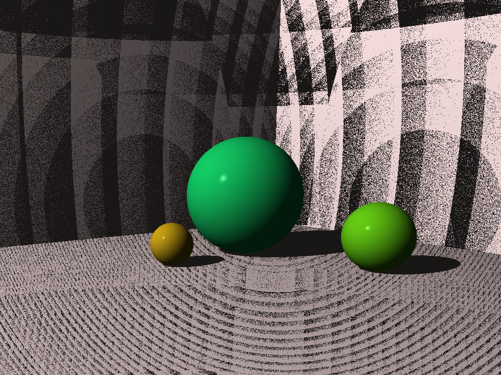

# Ray Tracer

**(Currently WIP)**

Implemented in C# completely from scratch. 
Based on Jamis Buck's book "Ray Tracer Challenge"

### Last rendered image:

I know that something is wrong with shadows in here. I am working on fixing it, but I thought this looks cool.
